# Interface designs

These are screenshots of the editable HTML/CSS prototype, not a shipped production editor. Source files are under `prototype/`; future workflow screens are explicitly labeled.

## 01 · Main editing surface

Live graph, palette and scoped property inspector. Source editing remains available through a drawer, not as the main authoring task.

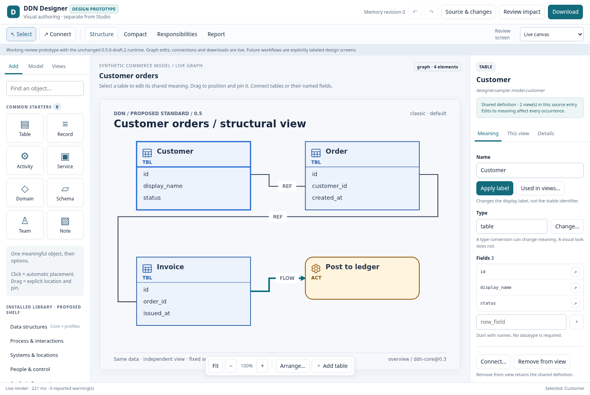

## 02 · Field-specific meaning

A field selection preserves its owner and ID. The advanced domain picker is a proposed workflow; label/connection actions are live.

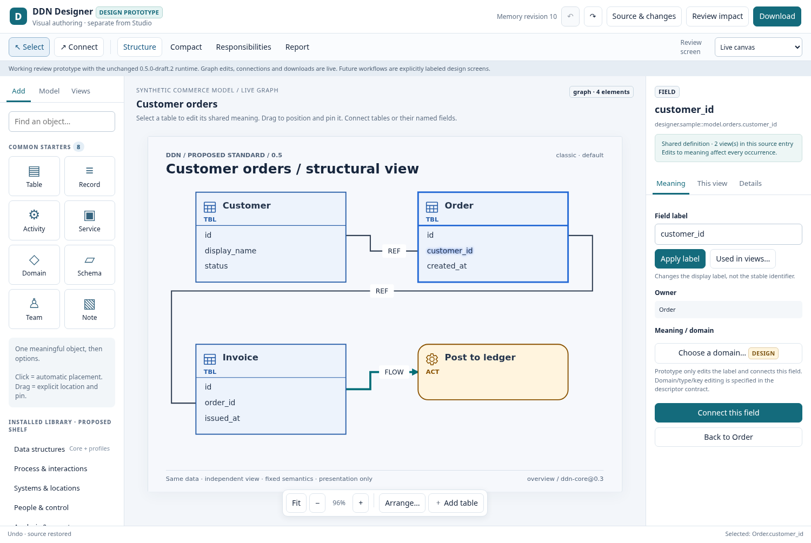

## 03 · Connection creation

Real source/target field selectors and a semantic relation type. Geometric routing is deliberately absent from this meaning sheet.

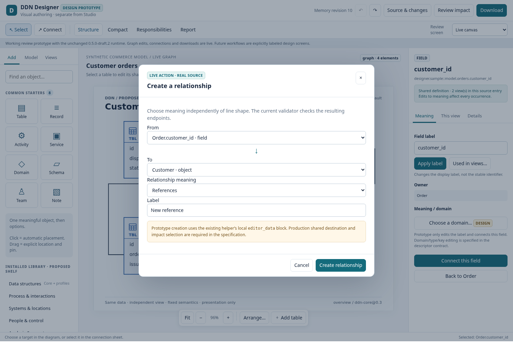

## 04 · Appearance and pinning

Live hand-drawn/night output. Source and semantics remain unchanged by preview controls; pin fields are explicit source operations.

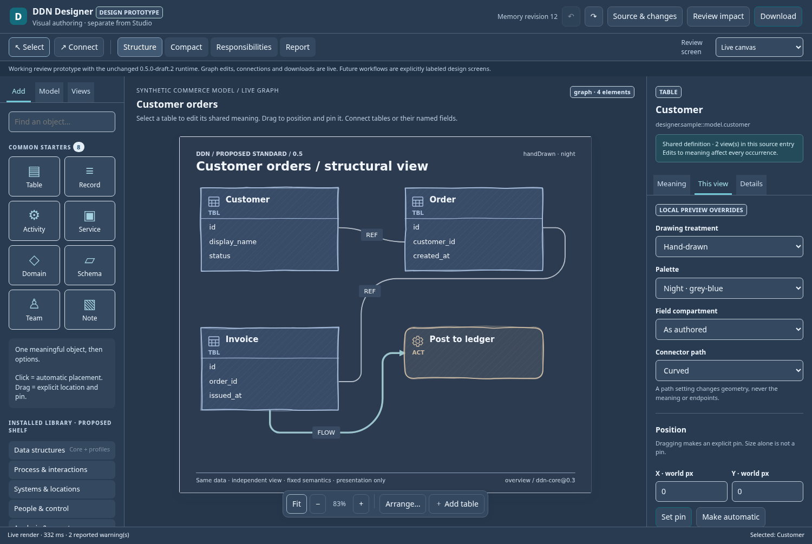

## 05 · Arrangement choices

A live whole-view layout selection. Future selected-region preview and persistent policy commands are separately specified.

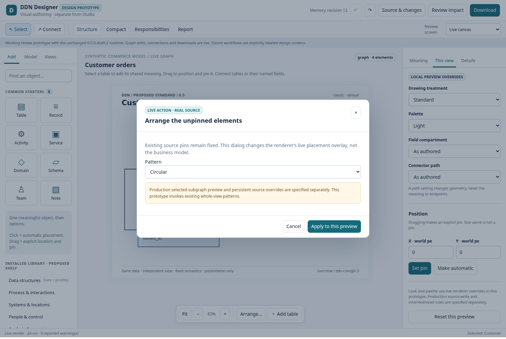

## 06 · Projection-aware workspace

Real RACI rendering. Inapplicable free-graph gestures are disabled; the right panel exposes the intended source bindings.

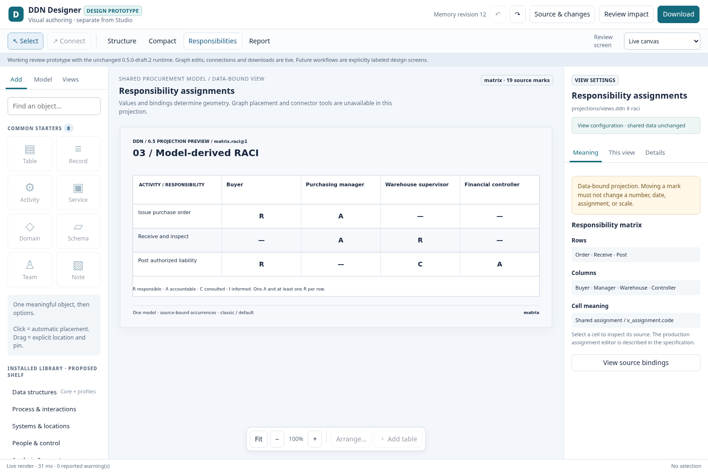

## 07 · Data-bound chart

Real native chart with source-bound marks. Data editing is separate from arbitrary shape movement.

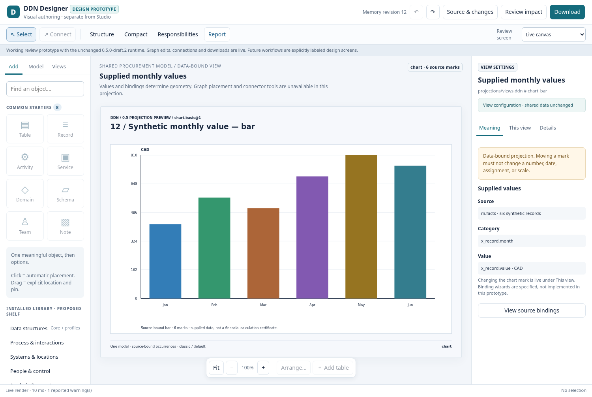

## 08 · Kind conversion review

Storyboard, not executed: lists retained meaning, dependencies and migration questions before a type change.

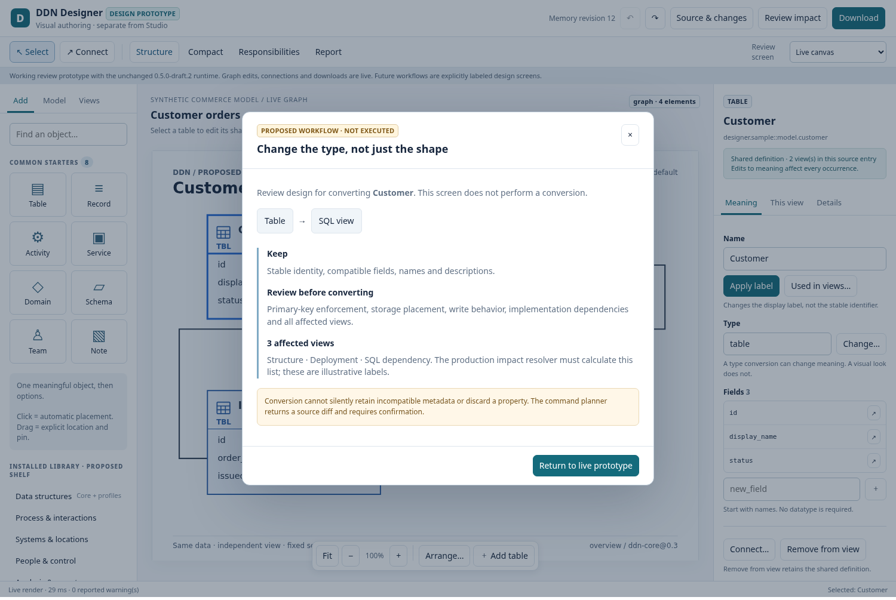

## 09 · Incomplete design obligations

Storyboard, not executed: recoverable incomplete graph design with strict review/export still required.

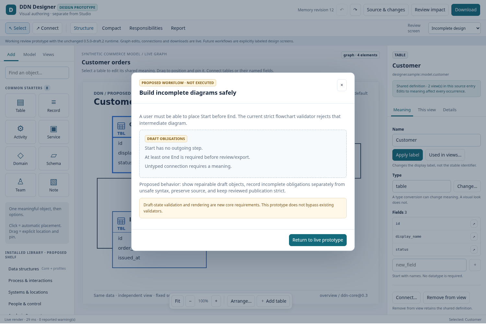

## 10 · Source inspection

The current DDN generated by actual prototype actions. Comments and stable references remain visible.

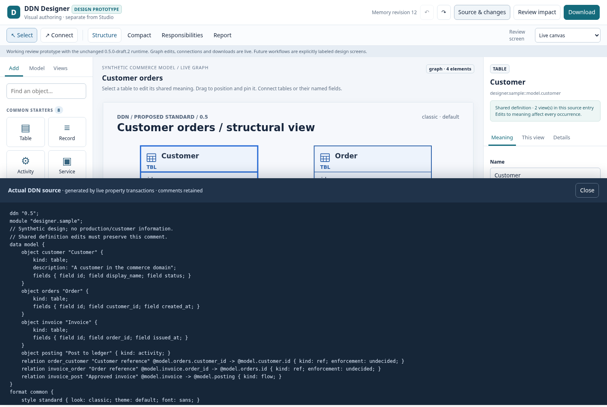

## 11 · Downloads

Live current DDN, workspace ZIP and SVG. Source downloads are not redacted publications.

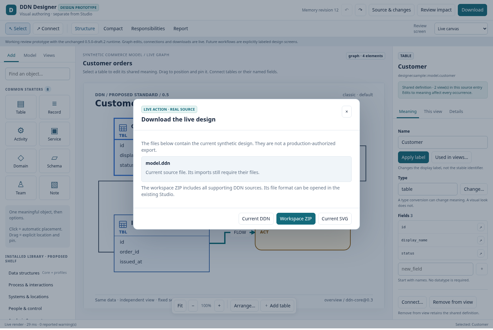

## 12 · Reduced desktop width

1180-pixel desktop composition. This is not a claim of complete mobile editing or assistive-tech qualification.

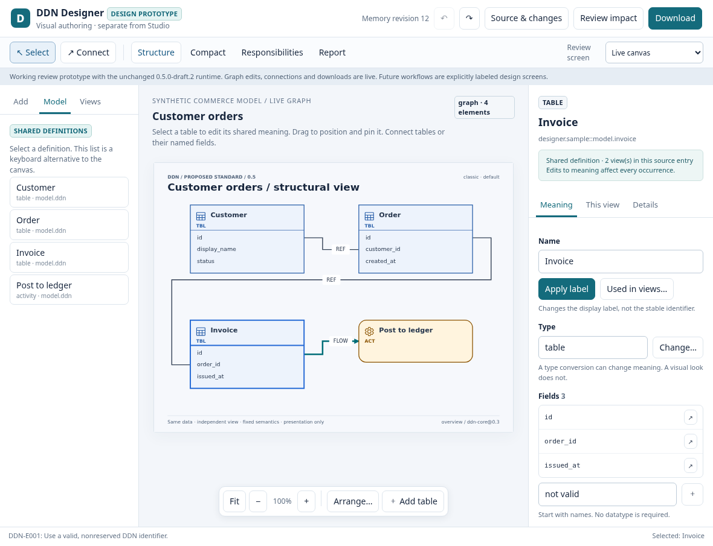
